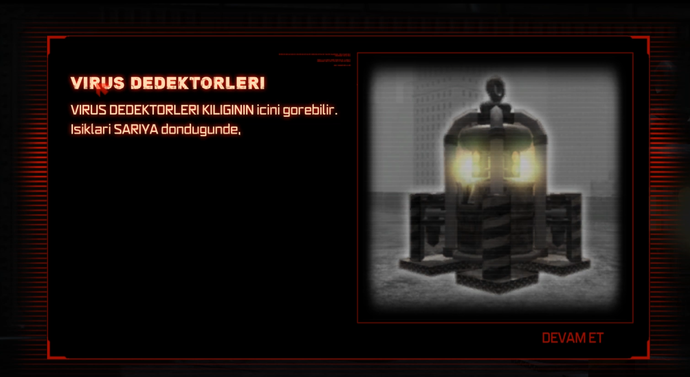
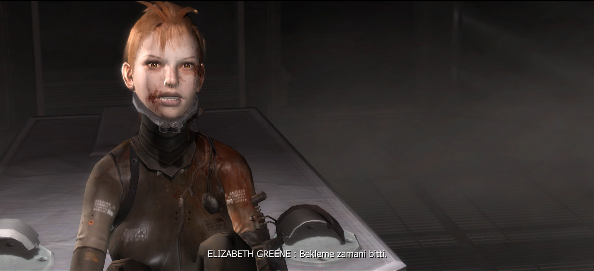
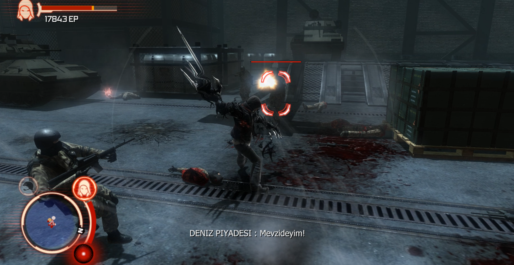
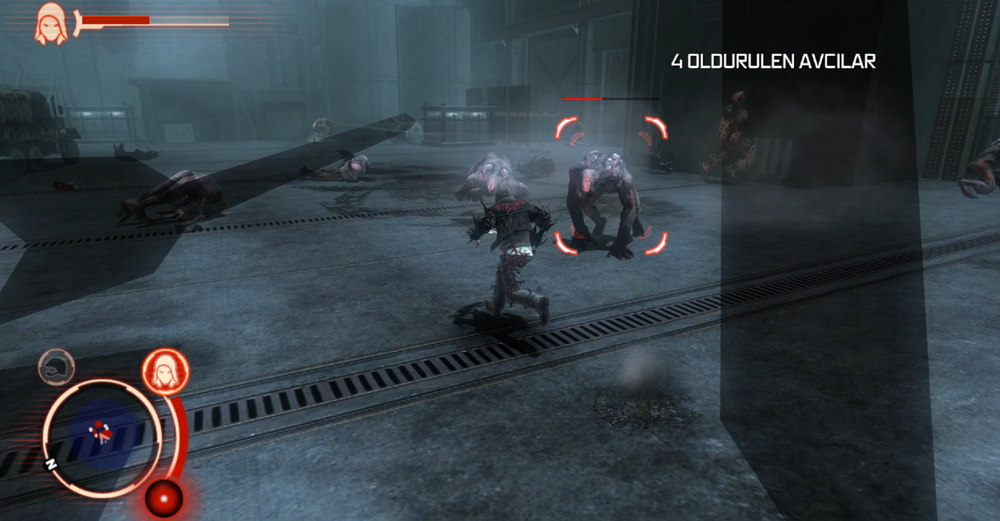
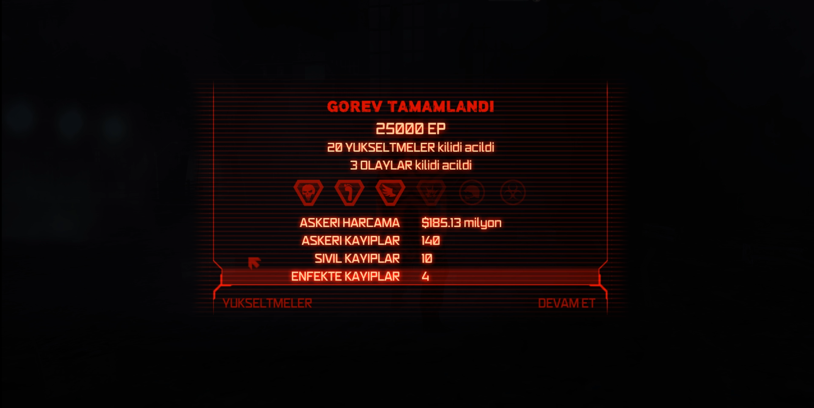
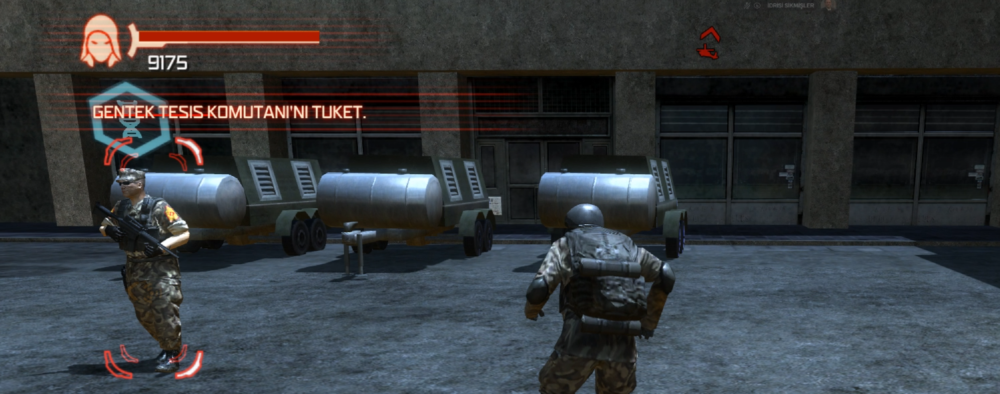
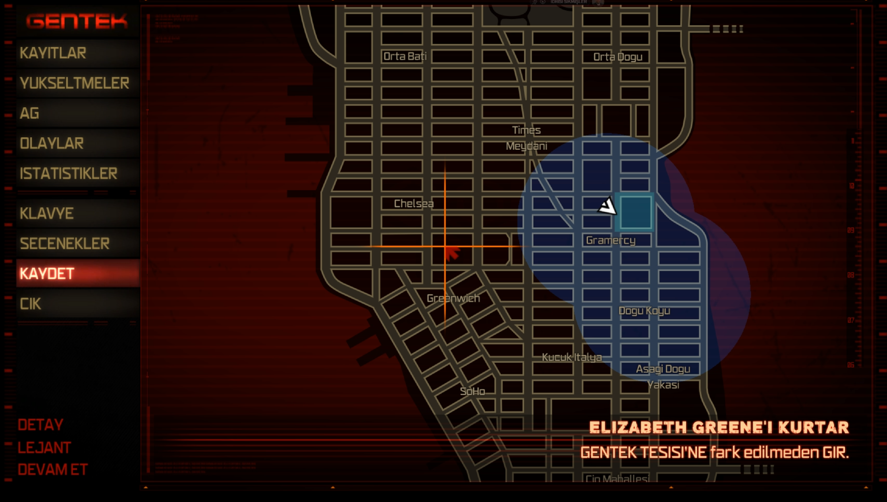
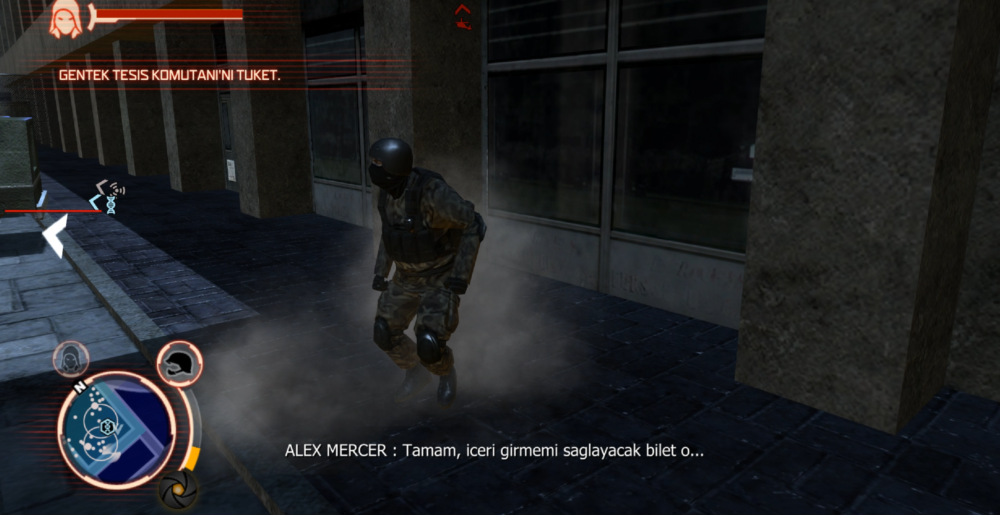

  

<h1 align="center">
Prototype 1 Turkish Translation
</h1>

Fan-made Turkish Localization Project

---

## About

This project aims to provide a comprehensive Turkish localization for Prototype 1.

The translation includes story content, NPC dialogues, military communications, radio conversations, interface elements, tutorials, subtitles, objectives, and various in-game texts.

---

## Translation Coverage

✅ Main Story

✅ Side Missions

✅ NPC Dialogues

✅ Military Communications

✅ Radio Conversations

✅ Tutorials

✅ Interface Elements

✅ Map Locations

✅ In-Game Objectives

✅ Subtitles

---

## Screenshots

### Gameplay

### HUD

### Map

### Subtitles

---

## Known Limitations

The original game font does not support Turkish-specific characters.

Affected characters:

- Ç → C
- Ğ → G
- İ → I
- Ö → O
- Ş → S
- Ü → U

This limitation originates from the original game's font system.

---

## Installation

1. Download the latest release.
2. Extract the archive.
3. Copy the files into your Prototype installation directory.
4. Launch the game.

---

## Disclaimer

Prototype and all related trademarks, assets, and intellectual property belong to their respective owners.

This repository contains a fan-made Turkish localization project created for educational and community purposes.

No ownership of the original game is claimed.
